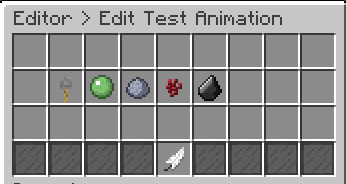
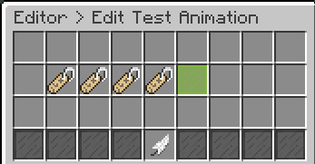

# Crates - Animations & Effects

Below we will explain how plugin animations work. There are two types of animations, "Idle animations" and "Opening Animations".

* "Idle Animations" will appear when the crate is not being opened. You can also choose not to have them.

* "Opening animations" will appear when the player is opening a crate. For them currently there are 5 animations:

  * Default Animation, Minecraft 1.8+
  * Ball Animation, Minecraft 1.8+
  * Key Opener Animation, Minecraft 1.8+
  * Fire Animation, Minecraft 1.8+
  * Compact Animation, Minecraft 1.8+

  **NOTE: In the future more animations will be released that will contain sounds and effects of latest versions!**

One of the interesting features of this plugin is that you can make a crate opening appear only for each particular player. This means that when you open a crate other players will not see you opening which means that the plugin allows players open crates simultaneously.

## Opening Animations

Opening animations are super easy to configure, just access the configuration panel of a crate type and click "Edit Opening Animations" icon and click on the icons that correspond to animation as you can see below:



## Idle Animations

Idle animations are a bit more difficult to set up but allow you to fully customize your animation!

### Effects

An idle animation is formed by a set of effects.

Effects are basically standards or types of particles that you can show in your animation.

Assuming you are in the main editing panel of a crate type by clicking "Edit Idle Animation" ICON you will come across the following menu:



When looking to the image above there are 4 initial icons, each corresponds to an effect as we can see in the image below:


#### Animation Effect

When clicking to edit a effect or even creating one you will see this menu:


Each effect is composed of 7 fields:

* **Effect Type** - The effect type will change the pattern of how the effect itself will be displayed. There are 11 patterns:

  * Default
  * Deltoid
  * Astroid
  * Flower
  * Circle
  * Quatrefoil
  * Diamond
  * Star
  * Ninja Star
  * Square
  * Spiral

  **NOTE: Recommended you test these patterns in the game itself for you to know what each one behave.**

* **Particulate type** - The type of particulate will define the particle that will be represented in the effect. In this case you will be able to select from a particle list.

* **Particle speed** - There are some particles that allow speed. This field allows you to change the speed of each spawned particle.

* **Color** - The color of a particle is not available for any type of particle. One of the most well-known particles that can change color is Redstone but is not the only one. In this case if you have a particle that does not support color this field will be ignored.

* **Offset** - Offset allows you to set the position this effect will be displayed relative to the position of the crate.

* **Radius** - This field allows you to define how much random will be the position according the relative position of each effect type.

* **Amount** - The amount of particles will set how many particles will be displayed in the standard. This means that if you use a circle pattern and a number of 2 you will see a 2 particle effect around the circle. (Recommended try on game)

#### Animation Templates

It can be difficult to find ideas for idle animations as well as creating an interesting one right from the start. For this we have prepared some animation templates that you can use as a basis to create yours.

These animations can only be entered from the crate configuration file. For this we recommend that you take a look [here](LINK_HERE) to know how to add the following animations in your crate.

**NOTE: Do not forget to update the animation the crate giving reload to the plugin!**

* Fire Animation:

  ```text
  - 'FLAME, #FFFFFF, 0.0, 0.0, 0.0, 0.0, 0.1, DEFAULT, 1'
  - 'REDSTONE, #FF0000, 0.0, 0.0, 0.0, 0.0, 0.0, CIRCLE, 2'
  ```

* Water Animation:

  ```text
  - 'BUBBLE_POP, #FFFF00, 0.0, 0.0, 0.0, 0.0, 0.0, SQUARE, 4'
  - 'REDSTONE, #00FFFF, 0.0, -0.1, 0.0, 0.0, 0.0, CIRCLE, 2'
  - 'SOUL_FIRE_FLAME, #FFFFFF, 0.0, 0.0, 0.0, 1.0, 0.0, DEFAULT, 1'
  - 'WARPED_SPORE, #FFFFFF, 0.0, 0.0, 0.0, 0.0, 0.0, DEFAULT, 1'
  ```

* Ender Animation:

  ```text
  - 'WHITE_ASH, #FF0000, 0.0, 0.0, 0.0, 1.0, 0.1, DEFAULT, 2'
  - 'PORTAL, #FFFFFF, 0.0, -1.0, 0.0, 0.0, 0.0, SPIRAL, 2'
  - 'REDSTONE, #9933FF, 0.0, -0.1, 0.0, 0.0, 0.0, CIRCLE, 1'
  - 'SPELL_MOB_AMBIENT, #FF00FF, 0.0, 0.0, 0.0, 1.0, 0.0, DEFAULT, 4'
  ```
