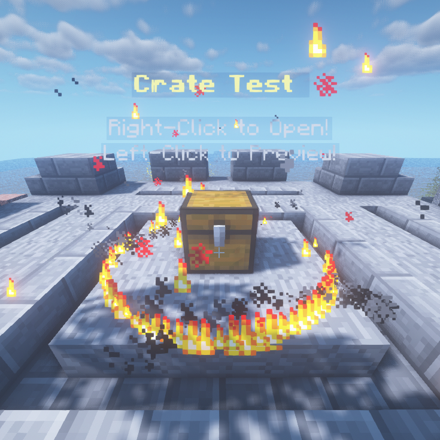

# Getting Started

## Installation

* Install PhoenixCrates-?.jar into your "Plugins" folder.
* Start your server
* Configure the plugin by yml file or by GUI menu
* Restart your server

**You can use PlugMan to reload the plugin whenever you want although this plugin have a command to do that but we always recommend stopping the server and starting it.**

## Creating a crate type

The first thing that will be important to be done is to create a new type. To create a crate type execute the next command:

> /crate create test common

## Configuring a crate type

You have two ways to set up your crate type that is through the configuration file or the ingame editor.

Details on how to configure a crate type:

* Learn how to configure through the ingame editor [here](LINK_HERE)

* Learn how to configure through the configuration file [here](LINK_HERE)

## Placing a crate

For you to allow your players to open a crate you need to put it on the floor.

For this just run the command:

> /crate giveCrate test

This command will give you the crate item that will allow you to add a crate when you right click with it on the floor.

## Opening a crate

Now you only need to have the correct key to open the key. To do this run the command:

> /crate giveKey test Splitrox_ 1

Remembering that this command also allows keys to all online players doing:

> /crate giveKey test all 1

After having the key you just need to click on with the key on the crate and enjoy!